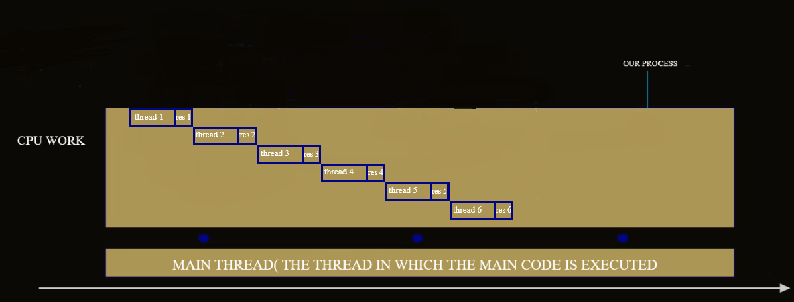

# research-on-python-code-acceleration

# Hello everyone
I am not a professional developer, but I decided to conduct research that interests me. If you find this interesting, you're welcome to join! If you notice any mistakes or issues, please let me know.

IO-bound and CPU-bound version

# IO-bound

## sync version

CPU waits for the response after each request, while CPU is waiting response - CPU is doing nothing.

### example

sync version io bound - file 
time taken - 8.5sec

### advantages

- very easy to understand, debug, maintain and modify.

### disadvantages

- it is slower than the other following approaches, but this may not be an issue if the speed fits your needs.

### important

- whenever speed is acceptable, use this approach. It is simple, clear for everyone, and reliable

## threads version

How does it work? 
So, when a thread is created, each thread makes a request to the server. While waiting for a response from the server,
the thread frees the GIL, allowing other threads to complete their tasks. This allows multiple threads to “run
concurrently,” although they are not literally executing in parallel through the GIL.

### example

thread version io bound - file 
time taken - 0.9sec

### advantages

- it works significantly faster than the synchronous version.

### disadvantages

- the code has become a little mode complicated. This would not be a defect if it were not for the possibility of
  getting a "race condition" and the need to write code taking this fact into account.

### important

- debugging such code can be really difficult. The use of technology is justified if it is even more difficult to
  achieve the required result in other ways.

## multiprocessing version

How does it work? 
So, When a process is created using multiprocessing, each process runs independently and performs a task. In the case of
our code, each process sends a request to the server. Unlike threads, which share the same memory space and are subject
to the Global Interpreter Lock (GIL), processes in multiprocessing have separate memory spaces. This means that each
process operates independently and can utilize different CPU cores.

While a process is waiting for a response from the server, it does not interfere with the other processes. Each process
can run simultaneously on different CPU cores. This true parallelism is achieved because each process has its own Python
interpreter and memory space, bypassing the limitations of the GIL.

In summary, multiprocessing allows multiple processes to execute truly in parallel. Each process sends requests
concurrently, and they don’t block each other, leading to more efficient execution compared to a single-threaded or
single-process approach.

### example

multiprocessing version io bound - file 
time taken - 6.0sec

### advantages

- we significantly accelerated execution of our IO-bound task

### disadvantages

- the code requires additional settings and the use of some unusual structures (for those who do not regularly work with
  multiprocessor code) and the code was clearly slower than the threading version.

### important

- multiprocessor code for IO-bound tasks is significantly inferior to multi-threaded code, as it does not increase the
  efficiency of utilization of core capacities and extensively increases the number of used cores with a low level of
  utilization on each one.

### conclusion

- do not use multiprocessing for IO-bound tasks. Only if you know what are you doing.

## async version

How does it work?  
So, In a cooperative multitasking system, each task or process is executed until it decides to transfer control to
another task. Tasks cooperate with each other by voluntarily releasing resources when they complete part of their work
or wait for a certain event (for example, I/O completion).

Asynchrony in Python is based on coroutines, which are functions that can pause their execution, releasing control to
other coroutines, and then resume their execution. This is what cooperative multitasking is all about: each coroutine
executes until it encounters the await keyword, which allows other tasks to execute while it waits.

### how does it work in code?

- A coroutine (an asynchronous function) runs until it reaches an operation that requires a wait (for example, waiting
  for a response from a server).
- When a coroutine encounters an await, it voluntarily hands over control of further execution to another coroutine that
  is ready to execute.
- As soon as the required event (for example, a server response) becomes available, control returns to the corresponding
  coroutine, and it continues its execution from where it was paused.

Thus, asynchrony in Python allows a program to execute multiple tasks simultaneously without using threads, by
voluntarily transferring control between tasks based on the expectation of certain events. This significantly reduces
the overhead of managing threads or processes and allows for higher efficiency.

### example

async version io bound - file 
time taken - 0.9sec

### Advantages

- works fast, the "race condition" problem cannot arise - therefore there is no need to use a special toolkit (as for
  treading), it also speeds up the development, debugging of the
  code.

### Disadvantages

- since the code must be able to interact with the control process (we already know that it is called an event cycle) -
  all the libraries you use must be able to do this, that is, support asynchrony. This problem is becoming less acute
  over time - because more and more packages are starting to support asynchrony.

## Conclusions on IO-bound functions

### Acceleration OI-bound tasks.

- relative synchronous is possible for all three tested approaches( multiprocessing, threading, asyncio). The best
  results demonstrate use of asyncio and the use of threading.

### Using threading requires

- additional effort when writing code to prevent "race conditions" and synchronize tasks.

### The use of multiprocessing

- for suck tasks has a low effect due to the limitation of the simultaneous execution of no more tasks than e
  processors( cores ) and the high "overhead" of launching additional processes.

### The use of asynchrony

- is quite simple and reliable, but requires the use of asynchronous versions of all libraries that are used in codes
  where waiting for results os possible.

# CPU-bound
CPU that was used - ryzen 5 3600x

## sync version

CPU performs function and gives result and then go to next function, step by step

## example

sync version cpu bound - file 
time taken - 8.22sec

advantages/disadvantages/importance - are the same as in IO-bound versions

## threads version

How does it work? 
When a thread is created, each thread starts performing its calculation. However, because these are CPU-bound tasks,
threads cannot release the Global Interpreter Lock (GIL) during the execution, unlike in the case of IO-bound tasks,
where the GIL can be released while waiting for input/output operations.

Since the GIL prevents multiple native threads from executing Python bytecode in parallel, even though we are using
multiple threads, only one thread can execute Python code at a time. This means that the threads are effectively blocked
from running in parallel. When a thread finishes its calculations, the GIL is released and handed over to another
thread, which then starts its execution.

As a result, we do not gain any performance improvement compared to the synchronous version. The execution time remains
almost the same because threads are not able to run truly concurrently for CPU-bound tasks due to the GIL.

## example

threads version cpu bound - file 
time taken - 8.24sec

## advantages

- Threads share the same memory space, which makes data sharing between threads more straightforward than in
  multiprocessing. This can reduce memory overhead compared to spawning multiple processes.

## disadvantages

- Due to the GIL, threading does not provide any performance improvements for CPU-bound tasks because only one thread
  can execute Python bytecode at a time. Threads are executed one after another, leading to no significant speedup.

## important

- Because of the GIL, threading will not improve performance for CPU-heavy tasks.

## multiprocessing version

How does it work? 
The same as in IO-bound tasks, each process runs independently and perform a task and does not interfere with the other
processes.

## example

multiprocessing version cpu bound - file 
time taken - 2.03sec

## advantages

- we significantly accelerated execution of CPU-bound tasks.

## disadvantage

- additional settings and more resource-consuming.

## important

- multiprocessing is the most suitable for CPU-bound tasks

## conclusion

- use multiprocessing for CPU-bound tasks.

## improved multiprocessing version

How we can improve multiprocessing version? 
So, When we start a new process or initiate a new Python interpreter for every task, it incurs significant resource
overhead, as each process must be created and then terminated after execution. This repetitive creation and destruction
of processes can be highly resource-intensive and inefficient.

To optimize this, we can pre-create a fixed number of processes at the start of the program. These processes remain
running and are reused for executing tasks throughout the program's lifecycle. By doing this, we avoid the continuous
overhead of creating new processes for each task, reducing resource consumption and improving overall performance.

## async version

How does it work? 
We have multiple tasks, but we can't switch between them efficiently because each task is CPU-bound. As a result, we
have to wait for one task to finish before the next one can start.

## example

async version cpu bound - file 
time taken - 8.09sec

## advantages

- no

## disadvantages

- we did not get any performance boost, due to CPU-bound tasks

## conclusion

- i do not recommend you to use that approach to CPU-bound tasks

# overall conclusion

- For IO-bound tasks, the most suitable approaches are those where the function does not need to wait for the previous
  function to finish. While the function is waiting for an I/O response, the CPU is idle. Therefore, control should be
  transferred to the next function in the queue. For instance, threading and asynchronous approaches work best here.
- For CPU-bound tasks, the best approaches are those where functions can truly run in parallel, without needing to
  transfer control between each other. This is possible with multiprocessing, as it bypasses Python's Global Interpreter
  Lock (GIL) limitations. Although multithreading could be an option in theory, it is not effective in Python due to the
  GIL, so multiprocessing is the preferred approach for CPU-bound tasks.
